# Домашнее задание к занятию "`Disaster recovery и Keepalived`" - `Сидоров Борис`

---
---

### Задание 1
- Дана [схема](1/hsrp_advanced.pkt) для Cisco Packet Tracer, рассматриваемая в лекции.
- На данной схеме уже настроено отслеживание интерфейсов маршрутизаторов Gi0/1 (для нулевой группы)
- Необходимо аналогично настроить отслеживание состояния интерфейсов Gi0/0 (для первой группы).
- Для проверки корректности настройки, разорвите один из кабелей между одним из маршрутизаторов и Switch0 и запустите ping между PC0 и Server0.
- На проверку отправьте получившуюся схему в формате pkt и скриншот, где виден процесс настройки маршрутизатора.

---

### Решение 1
Суть такова, что в схеме представленной в задании настроено отслеживание только для нулевой группы по порту **g0/1**, соответственно отказоустойчивость будет срабатывать только когда мы отключаем именно порт **g0/1** т.к. срабатывает отслеживание и приоритет на порту **g0/0** падает на **10** вследствие чего происходит переключение на соседнем роутере из состояния **standby** (резерв) в состояние **active** и отказоустойчивость срабатывает и пинг будет доходит с конечного устройства на устройство находящиеся в другой сети. Что и было продемонстрировано на видео примере.

В данной схеме помимо отсутствия отслеживания интерфейсов для первой группы выставлены разные приоритеты и даже если бы отслеживание было бы настроено для всех интерфейсов, то приоритет на **Router1** для первой группы все равно был бы ниже в случае падения порта **g0/0** на **Router2** и понижения приоритета первой группы. Router1 не перешел бы из резерва в актив. Так же в схеме на **Router1** не включена опция **preempt** для первой группы, из-за чего роутер не вернется в активное состояния после восстановления сбоя на проблемном порту. Я выписал первоначальные настройки для наглядности:

```
R1
Interface Grp Pri P State Active Standby Virtual IP
Gig0/0 0 105 P Active local 192.168.0.3 192.168.0.1
Gig0/1 1 50 Standby 192.168.1.3 local 192.168.1.1

GigabitEthernet0/0 - Group 0
Track interface GigabitEthernet0/1 state Up decrement 10
GigabitEthernet0/1 - Group 1
!no Track interface

R2
Interface Grp Pri P State Active Standby Virtual IP
Gig0/0 0 100 P Standby 192.168.0.2 local 192.168.0.1
Gig0/1 1 100 P Active local 192.168.1.2 192.168.1.1

GigabitEthernet0/0 - Group 0
Track interface GigabitEthernet0/1 state Up decrement 10
GigabitEthernet0/1 - Group 1
!no Track interface
```

Вот какие изменения я внес в маршрутизаторы
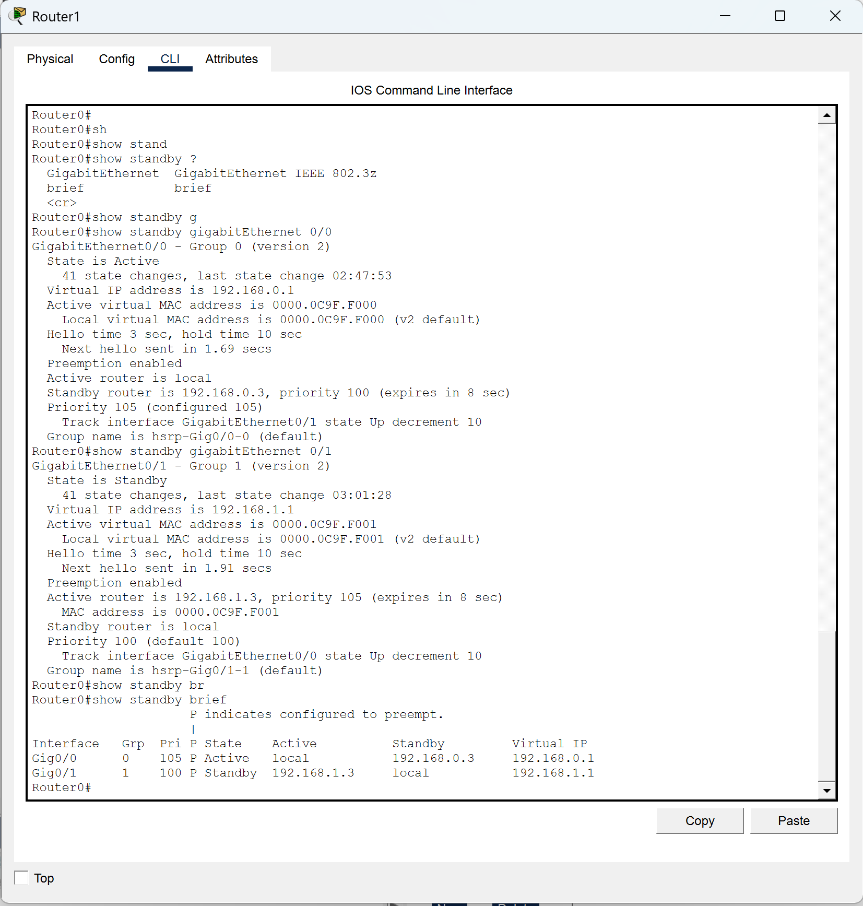

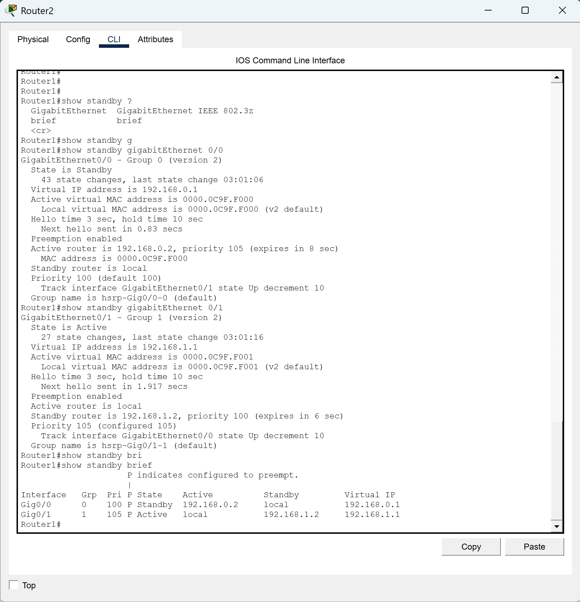

После внесения моих настроек отказоустойчивость срабатывает на всех группах, на всех маршрутизаторах.

Команды для конфигурации отслеживания вводил в режиме настройки интерфейса.
Лабораторный проект:
[hsrp_completed.pkt](files/hw-01/task-1/hsrp_completed.pkt)

---
---

### Задание 2
- Запустите две виртуальные машины Linux, установите и настройте сервис Keepalived как в лекции, используя пример конфигурационного [файла](files/hw-01/task-1/hsrp_advanced.pkt).
- Настройте любой веб-сервер (например, nginx или simple python server) на двух виртуальных машинах
- Напишите Bash-скрипт, который будет проверять доступность порта данного веб-сервера и существование файла index.html в root-директории данного веб-сервера.
- Настройте Keepalived так, чтобы он запускал данный скрипт каждые 3 секунды и переносил виртуальный IP на другой сервер, если bash-скрипт завершался с кодом, отличным от нуля (то есть порт веб-сервера был недоступен или отсутствовал index.html). Используйте для этого секцию vrrp_script
- На проверку отправьте получившейся bash-скрипт и конфигурационный файл keepalived, а также скриншот с демонстрацией переезда плавающего ip на другой сервер в случае недоступности порта или файла index.html

---

### Решение 2
Первым делом приступил к установке сервиса **keepalived** и его конфигурации. Скрин настроенного конфигурационного файла на двух ВМ.
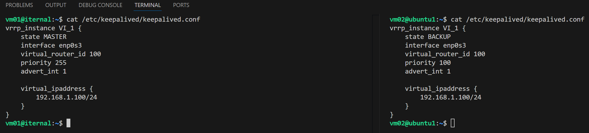

Установил **nginx** и сконфигурировал страницу приветствия на примере из видео. Пробую открыть web страницы для проверки, VM `192.168.1.66` является мастеров для **keepalived**.
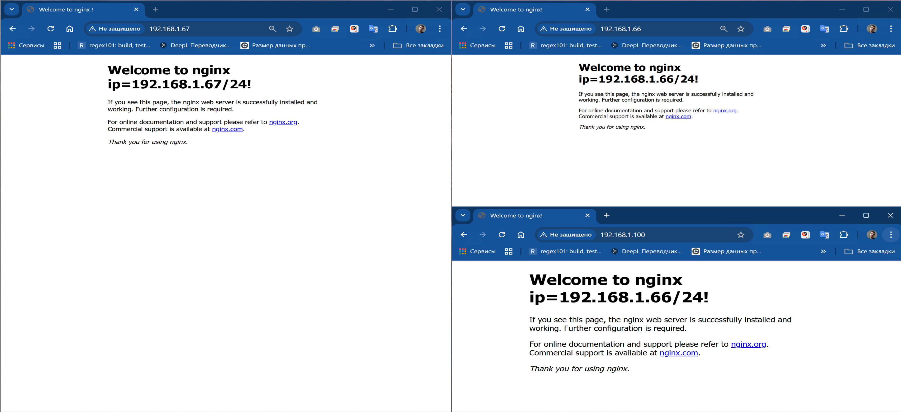

Создал небольшой скрипт для проверки порта **80** используя утилиту `nc` и оператор для проверки существования файла на ВМ.
[script](files/hw-01/task-2/check_nginx.sh)


Отредактировал конфигурационный файл `keepalived.conf` добавив в него ещё два блока настроек:
*   `global_defs` - где включается режим защиты скриптов от редактирования скриптов без прав root. Также указывается пользователь который является владельцем отслеживающего скрипта так как права на скрипт для root я не выставлял в целях безопасности.
*   `vrrp_script my_script` - блок настроек где указана путь до скрипта, интервал проверки скрипта, вес приоритета который будет добавлен к существующему в случае выполнения скрипта с кодом возврата отличным от нуля, и пользователь владельца скрипта.
В итоге получается похожий механизм переключения хоста с **MASTER** на **BACKUP** при неудачном завершении работы скрипта как в случае с симулятором cisco и протокола **HSRP**.

Пробую остановить сервис nginx на MASTER хосте ip `192.168.1.66` и проверить что показывает браузер VIP `192.168.1.100`.
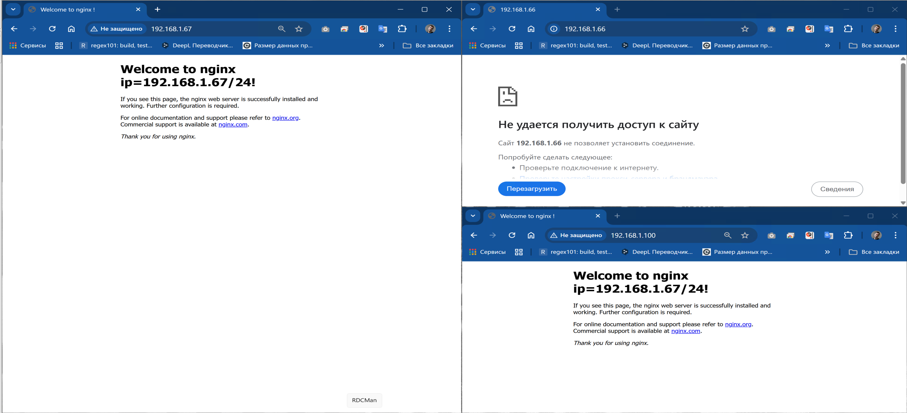

Работает! VIP `192.168.1.100` переключился на BACKUP хост с ip `192.168.1.67`, в свою очередь по ip `192.168.1.66` вижу что страница недоступна.
Проверю логи **keepalived**.
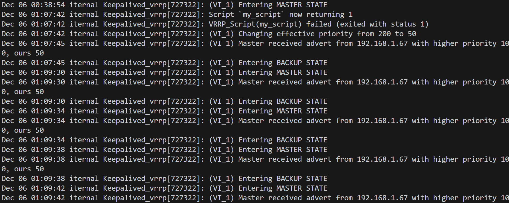

В логах вижу как происходит переключение из состояния **MASTER** на **BACKUP**, а также получает сообщение от ip `192.168.1.67` c более высоким приоритетом.

Как только я восстанавливаю работу сервиса nginx, приоритет меняется снова происходит обратное переключение из **BACKUP** на **MASTER**.
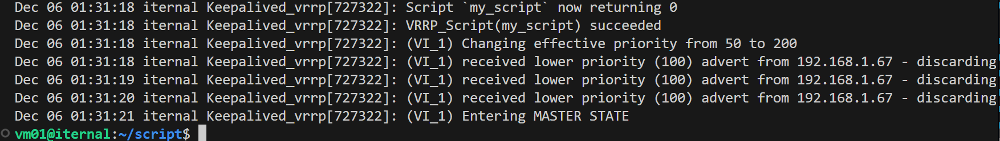

Мой итоговый конфигурационный файл `keepalived.conf` на MASTER хосте такой:
[keepalived.conf](files/hw-01/task-2/keepalived.conf)

```
global_defs {
	enable_script_security
	script_user vm01
}

vrrp_script my_script {
	script "/home/vm01/script/check_nginx.sh"
	interval 3
	weight -150
	user vm01
}

vrrp_instance VI_1 {
	state MASTER
	interface enp0s3
	virtual_router_id 100
	priority 200
	advert_int 1

	virtual_ipaddress {
		192.168.1.100/24
	}

	track_script {
		my_script
	}

}
```
На BACKUP хосте такой оставил без изменений:

```
vrrp_instance VI_1 {
    state BACKUP 
    interface enp0s3
    virtual_router_id 100
    priority 100
    advert_int 1

    virtual_ipaddress {
        192.168.1.100/24
    }
}
```

!Из важного, я изменил приоритет с 255 на 200 т.к. при приоритете 255 отключается функционал с добавлением веса приоритета.

---
---

### Задание 3*
- Изучите дополнительно возможность Keepalived, которая называется vrrp_track_file
- Напишите bash-скрипт, который будет менять приоритет внутри файла в зависимости от нагрузки на виртуальную машину (можно разместить данный скрипт в cron и запускать каждую минуту). Рассчитывать приоритет можно, например, на основании Load average.
- Настройте Keepalived на отслеживание данного файла.
- Нагрузите одну из виртуальных машин, которая находится в состоянии MASTER и имеет активный виртуальный IP и проверьте, чтобы через некоторое время она перешла в состояние SLAVE из-за высокой нагрузки и виртуальный IP переехал на другой, менее нагруженный сервер.
- Попробуйте выполнить настройку keepalived на третьем сервере и скорректировать при необходимости формулу так, чтобы плавающий ip адрес всегда был прикреплен к серверу, имеющему наименьшую нагрузку.
- На проверку отправьте получившийся bash-скрипт и конфигурационный файл keepalived, а также скриншоты логов keepalived с серверов при разных нагрузках

---

### Решение 3*
Суть функции **`track_file`** в рамках сервиса **Keepalived**, заключается в том, что мы в конфигурации сервиса задаем какой файл сервис будет отслеживать на предмет значения внутри него, и это значения он будет прибавлять к текущему приоритету. Также можно есть возможность данное значение принимать как есть или умножать вдвое или так как требует поставленная задача.
Для того чтобы в этом файле что-то появлялось я создал скрипт который будет высчитывать среднее взятое из показателей **`loadavarage`** за одну минуту деленное на количество процессоров в системе, ведь количество ядер на хостах может быть разное. Далее в скрипте через условие **`if else`** будет формироваться отрицательное число на основе текущей нагрузки системы, чем выше нагрузка, тем больше будет отрицательное число. По итогу скрипт получился у меня таким:
[script](files/hw-01/task-3/check_loadavg.sh)
```bash
COUNT_CPU=$(nproc)
LOAD_AVARAGE_1MIN=$(cat /proc/loadavg | cut -d' ' -f1)
CURRENT_LOAD=$(echo "scale=3; ${LOAD_AVARAGE_1MIN} / ${COUNT_CPU}" | bc -l)
PRIORITY=0
TRACK_FILE="/etc/keepalived/load_priority"


if (( $(echo "$CURRENT_LOAD >= 0.70" | bc -l) )); then PRIORITY=-50
elif (( $(echo "$CURRENT_LOAD > 0.25" | bc -l) )); then PRIORITY=-15
else PRIORITY=0
fi

echo $PRIORITY > $TRACK_FILE
echo "$PRIORITY"
```

В скрипте решил применять формулу loadavarage за 1 минут делю на количество ядер, получаю число **0.XXX** в тысячных для более точных показателей, а сравнивать буду с **0.70** `(где 0.70 это 70% нагрузки на систему)`, **0.25**  `(0.25 это 25% нагрузки)`. Сперв будет проверять максимальная нагрузка, если условие будет истинно, то в файл запишется значение **-50**, а в случае с 0.25 будет начисляться **-15**. Условий можно добавлять по необходимости, но так как это тесты сделал только две проверки.

Далее, для того чтобы скрипт выполнялся автоматически, добавил через sudo `crontab -e` запись:
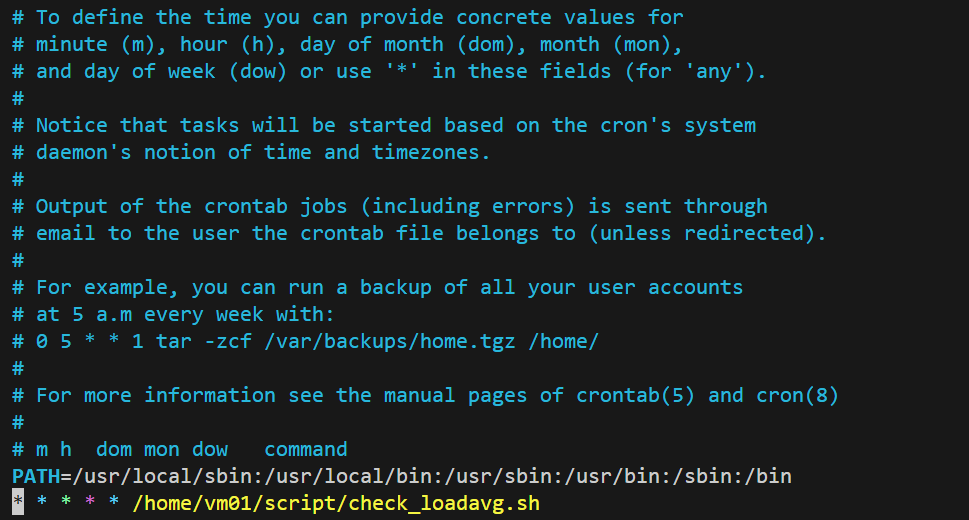

помимо пути к скрипту добавил системную переменную **PATH** с путями к основным пакетам, т.к скрипт будет запускать от root и в этом случае рабочая среда с пакетами будет сильно ограничена.
Файл куда будет осуществляться запись:
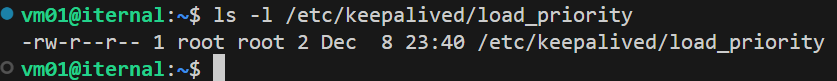

сам скрипт который будет запускать от root раз в минуту


Конфигурационный файл сервиса keepalived по итогу получился таким:
[keepalived.conf](files/hw-01/task-3/keepalived.conf)

```
global_defs {
	enable_script_security
	script_user vm01
}

vrrp_script my_script {
	script "/home/vm01/script/check_nginx.sh"
	interval 3
	weight -150
	user vm01
}

track_file load_avg_file {
	file "/etc/keepalived/load_priority"
	weight 1
}

vrrp_instance VI_1 {
	state MASTER
	interface enp0s3
	virtual_router_id 100
	priority 110
	advert_int 1

	virtual_ipaddress {
		192.168.1.100/24
	}

	track_script {
		my_script
	}

	track_file {
		load_avg_file
	}

}
```

Добавил блок с  **track_file** с названием **load avg file** в котором указан абсолютный путь к файлу и **вес 1** который означает принимать значение файла как есть. Далее внутри основного блока **vrrp_instance VI_1** добавил пункт **track_file** в котором указал название блока track_file, а именно **load_avg_file** `(примечание: это не имя файла на хосте, а наименование блока track_file)`. На данном хосте приоритет будет чуть выше, **110**, в отличии от хостов **backup**, там приоритет будет **100**, т.к. в моем сценарии хост `vm01(192.168.1.66)` будет выступать основным,а хосты `vm02(192.168.1.67)` и `vm03(192.168.1.68)` будут резервные.

Далее на хостах vm02 и vm03 осуществил те же манипуляции: создал скрипт, создал отслеживаемый файл, добавил запись в crontab от root, назначил владельца скрипта root, отредактировал конфигурационный файл.
На резервных хостах конфигурационный файл получился следующим:

```
track_file load_avg_file {
file "/etc/keepalived/load_priority"
weight 1
}

vrrp_instance VI_1 {
    state BACKUP 
    interface enp0s3
    virtual_router_id 100
    priority 100
    advert_int 1

    virtual_ipaddress {
        192.168.1.100/24
    }

    track_file {
        load_avg_file
    }    
}
```

Таким образом виртуальный ip 192.168.1.100/24 будет перключаться на тот хост на котором нагрузка будет минимальная, т.е. на тот хост у которого приоритет выше, а опускаться приоритет будет в случае прибавления отрицательного числа в результате работы скрипта.

Проверяем работу сервиса. Исходные данные: 3 хоста с веб страницей nginx
`vm01 192.168.1.66`
`vm02 192.168.1.67`
`vm03 192.168.1.73`
`VIP 192.168.1.100` мастером поумолчанию которого будет хост `vm01 192.168.1.66`
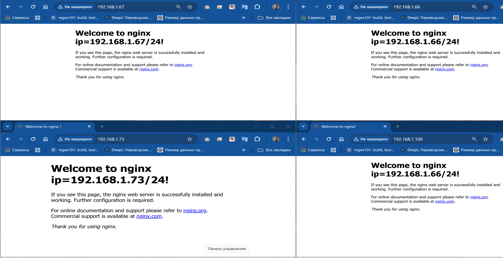

нагружаю основной хост **vm01**, запускаю `stress –cpu1`


жду когда приоритет опуститься и другой хост перехватить стату **MASTER**.
Смотрю логи на хосте и вижу, что приоритет и статус изменился на **BACKUP**
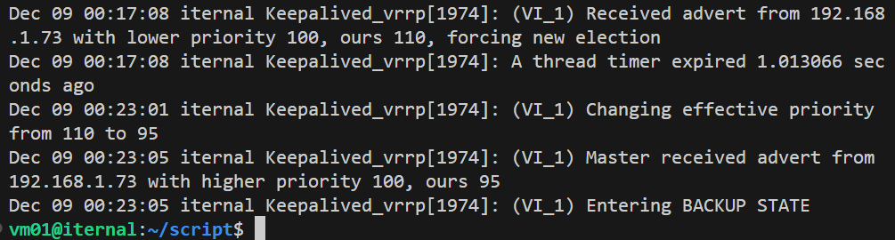

По логам видно, что было понижение приоритета `с 110 до 95` и  было принято сообщени от хоста с ip `192.168.1.73` с более высоким приоритетом **100**. Обновим страницу с VIP и проверим какой ip будет отображаться на странице nginx
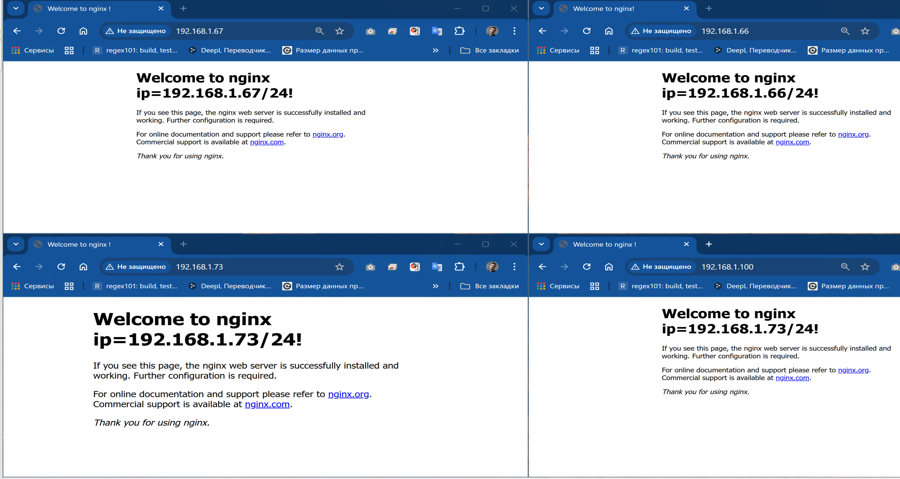

да действительно, тепрь `по ip 192.168.1.100` я попадаю на странице nginx хоста `vm03 c ip 192.168.1.73`.

Теперь попробую нагрузить и хост vm03.


Смотрю логи, жду изменения приоритета и состояния текущего хоста
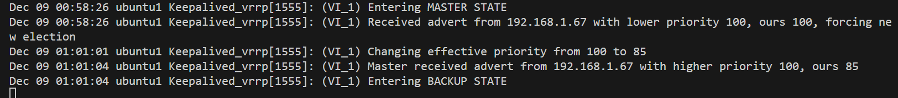

вижу, что приоритет упал до **85** и статус изменился на  **BACKUP**. Обновляю сраницу с VIP и смотрю, какой ip будет указан теперь.
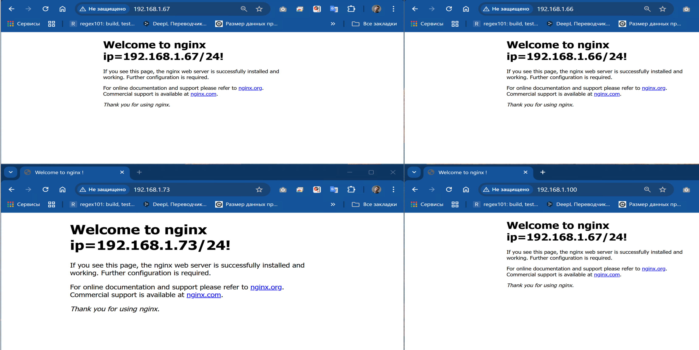

да, теперь VIP перекочевал `на хост vm02 с ip 192.168.1.67` который я не нагружал. Проверю логи и там
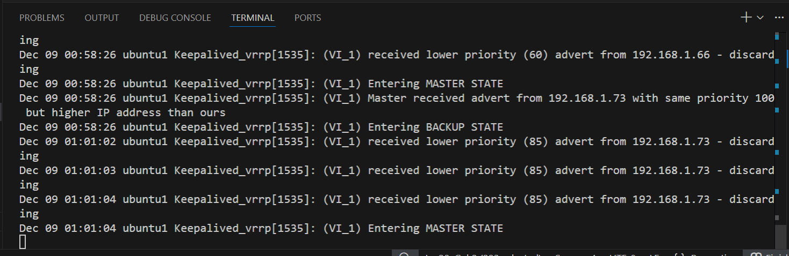

действительно статус поменял с **BACKUP** на **MASTER**, т.к хосты в группе имееют приоритет ниже из-за нагрузки `192.168.1.66 опустился до 60`, а `192.168.1.73 до 85`. 

Таким образом отказоустойчивость сработала и протокол VRRP работает, VIP переключается на более разгруженный хост.
