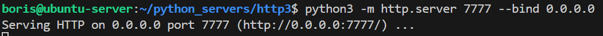
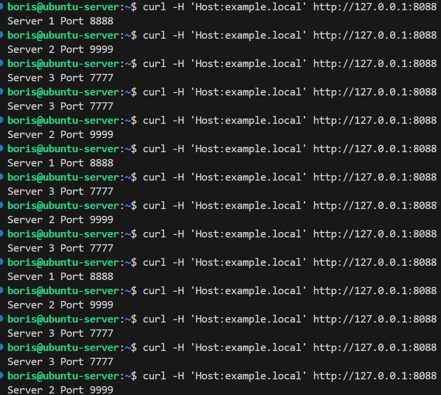
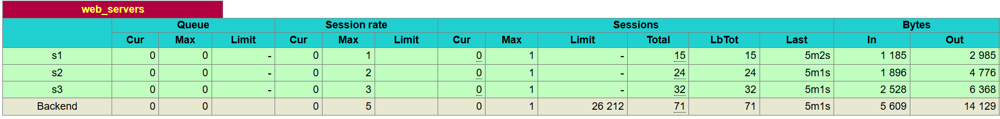
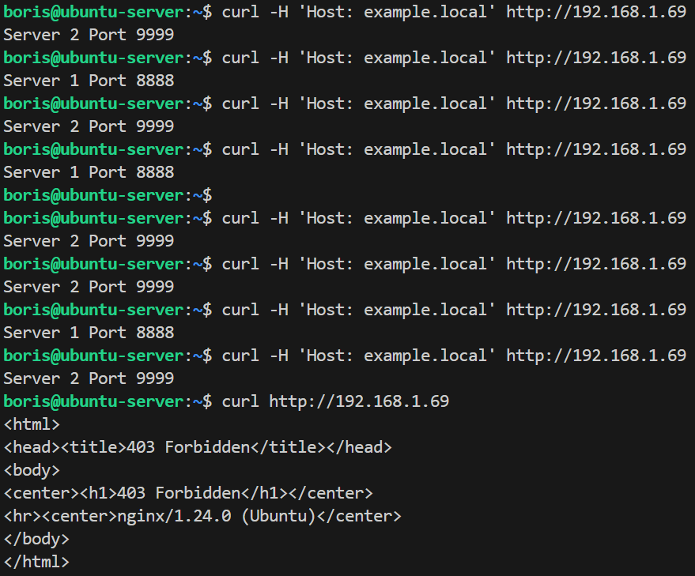
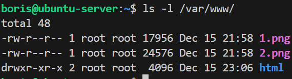

# Домашнее задание к занятию "`Кластеризация и балансировка нагрузки`" - `Сидоров Борис`

---
---

### Задание 1
- Запустите два simple python сервера на своей виртуальной машине на разных портах
- Установите и настройте HAProxy, воспользуйтесь материалами к лекции по [ссылке](2/)
- Настройте балансировку Round-robin на 4 уровне.
- На проверку направьте конфигурационный файл haproxy, скриншоты, где видно перенаправление запросов на разные серверы при обращении к HAProxy.

---

### Решение 1
Подготовил тестовую среду для проведения работ по балансировки нагрузки, а именно:
- запустил два simple python сервера в ранее созданных директориях с файлам **`index.html`**, содержимое которых **`Server 1 Port 8888`** и **`9999`** для второго соответственно. Запускал сервера используя команду из лекции **`python3 -m http.server 8888 --bind 0.0.0.0`**
- установил сервис **HAProxy** с конфигурационным файлом


поля с правилом **`ACL_example`** пока закомментировал,  так как по заданию пока не требуются.
проверяю работу сервиса на уровне **L7**, как было настроено изначально на примере.


да метод **`roundrobin`** работает.

Теперь, редактирую конфиуграционный файл под требование задания. Меняю режим **`mode`** с **`http`** на **`tcp`** в секции **`frontend`** и **`backend`**, а также в секции **`default`** в строке **`mode`** выставляю **`tcp`**, а в строке **`option`** меняю на **`tcplog`**. Ещё изменил опцию проверки серверов с  **`httpchk`** на **`tcp-check`**, а строку **`http-check send meth GET uri /index.html`** просто удалил, так как балансировка уже будет работоть не на уровне L7,а на уровне L4. Вместо проверки по http запросу будет выполняться простая проверка на уровне L4, сервис будет пытаться установить tcp соединения с портом сервера. Проверка реализовывается благодаря директиве **`option tcp-check`** и ключевому слову **`check`** после указания ip и порта сервера. По итогу конфигурационный файл стал таким:
[L4_haproxy.cfg](files/hw-02/task-1/haproxy.cfg)

Перезапускаю сервис **`haproxy`** через **`reload`** и пробую ещё раз обратиться к **`haproxy`** через **`curl`**


---
---

### Задание 2
- Запустите три simple python сервера на своей виртуальной машине на разных портах
- Настройте балансировку Weighted Round Robin на 7 уровне, чтобы первый сервер имел вес 2, второй - 3, а третий - 4
- HAproxy должен балансировать только тот http-трафик, который адресован домену example.local
- На проверку направьте конфигурационный файл haproxy, скриншоты, где видно перенаправление запросов на разные серверы при обращении к HAProxy c использованием домена example.local и без него.

---

### Решение 2
Создал 3й python сервер по аналогии как в первом задании, в файле **`index.html`** будет следующее наполнение **"Server 3 Port 7777"**. Запускаю сервер на порту **`7777`** для удобства восприятия.


Так как по зданию нужно осуществить балансировку на уровне **L7**, я вернул в директиве **`mode`** параметр **`http`** в секция **`frontend`** и **`backend`** и соответствующие проверки серверов.
Для реализации балансировки трафика по заданному заголовку **`example.local`**, раскомментировал созданное правило **`acl`** и отредактировал заголовок под задачу. Так как балансировка должна работать исключительно по заголовку, директиву **`default_backend web_servers`** я закомментировал.
Для реализации балансировки по методу **Weighted round robin** в секции **`backend`** к каждому серверу добавил запись с указанием веса, например вес первого сервера должен быть равным **2** `server s1 127.0.0.1:8888 check weight 2`. Итоговый конфигурационный файл получился таким:
[haproxy.cfg](files/hw-02/task-2/haproxy.cfg)

Перезапускаю сервис **`haproxy`** и проверяю балансировку через утилиту **`curl`** с использованием заголовка **`example.local`** командой **`curl -H 'Host:example.com' http://127.0.0.1:8088`**. Для наглядности делаю небольшой флуд запросов чтоб убедиться, что развесовка по серверам работает.


Проверяю статистику на веб-странице статистики сервиса.


Вижу, что больше всего сессий было направлено на сервер **`s3`**, а он и имеет больший вес. Балансировка работает корректно.
Теперь попробую сделать запрос без заголовка как в первой задаче **`curl http://127.0.0.1:8088`**.


Получаю ответ **`503`**, что сервис недоступен и нет доступных серверов которые могут обработать данный запрос.

---
---

### Задание 3*
- Настройте связку HAProxy + Nginx как было показано на лекции.
- Настройте Nginx так, чтобы файлы .jpg выдавались самим Nginx (предварительно разместите несколько тестовых картинок в директории /var/www/), а остальные запросы переадресовывались на HAProxy, который в свою очередь переадресовывал их на два Simple Python server.
- На проверку направьте конфигурационные файлы nginx, HAProxy, скриншоты с запросами jpg картинок и других файлов на Simple Python Server, демонстрирующие корректную настройку.

---

### Решение 3
Для настройки совместной работы связки **HAProxy + nginx** я приступил к созданию отдельного конфигурационного файла по пути **`/etc/nginx/conf.d/`** название сделал как в примере из лекции **`example-http.conf`**. Наполнение данного файла выглядит следующим образом:
```
server {
   listen	80;
   

   server_name	example.local;
   

   access_log	/var/log/nginx/example-http.com-acess.log;
   error_log	/var/log/nginx/example-http.com-error.log;

   location / {
proxy_pass	http://localhost:1325;
   }

}
```

Логика работы **nginx** в этом случае будет как реверс прокси для заголовка **`example.local`**, все сообщения которые поступают на **80 порт** будут перенаправлены на адрес **`127.0.0.1`** на порт **`1325`**.
Следующим шагом мне нужно донастроить **haproxy** на обработку трафика который **nginx** будет перенаправлять на порт **`1325`**. Для это в конфигурационном файле я добавлю новую секцию **`listen`** и привяжу к целевому порту **`1325`**, также добавлю пул пайтон серверов исходя из задания плюс вес сервера. Получается добавлю вот такой блок кода:
```
listen web_tcp

	bind :1325
	balance roundrobin
	server s1 127.0.0.1:8888 check weight 2 
	server s2 127.0.0.1:9999 check weight 3
```

Теперь весь трафик который перенаправляет **nginx**, будет попадать в сервис **haproxy** и тот в свою очередь будет осуществлять балансировку по методу **`roundrobin`** + вес сервера.
Пробую делать тестовые запросы с заголовком и без.


Все работает как задумано. Теперь необходимо добавить в **nginx** ещё один блок записи для картинок. Для этого я добавил следующий блок **`location`**:
```
  location  ~ \.(gif|jpg|png)$ {
      root /var/www/;
      try_files $uri $uri/ =404;
   }
```

Для картинок, как требовало условие задания, указал корневую директорию **`root`** по пути **`/var/www/`** единственно расширил формат добавив **`gif`** и **`png`**. Разместил картинки с название **`1`** и **`2`** в корневой директории.


Перезапускаю сервис **nginx** через **`reload`** и проверяю работу **nginx + haproxy**. Для более наглядного примера с другого ПК решил сделать тесты через браузер, а заголовок буду имитировать записью в файле host **`192.168.1.69 example.local`**.


Попробовал разные варианты запросов в браузере и получил разный вариант ответа исходя из конфигураций двух сервисов **`nginx+haproxy`**.
Теперь попробую через **`curl`** на хосте.


По итогу конфигурационный файл nginx получился таким:
[example-http.conf](files/hw-02/task-3/example-http.conf)

и конфигурационный файл haproxy:
[haproxy.cfg](files/hw-02/task-3/haproxy.cfg)