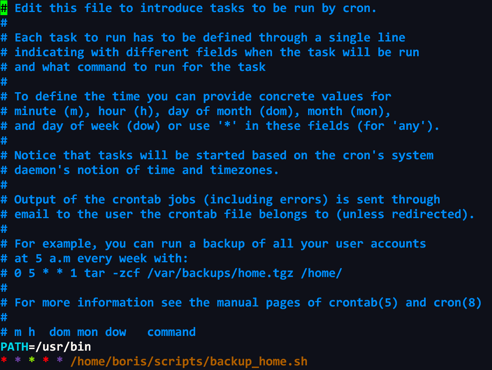
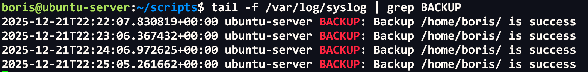
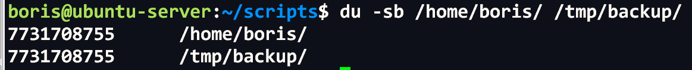
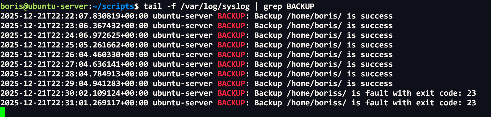
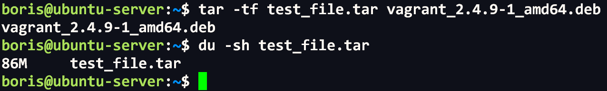
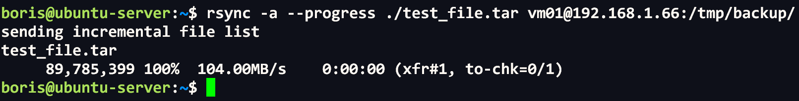
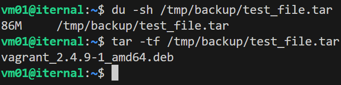
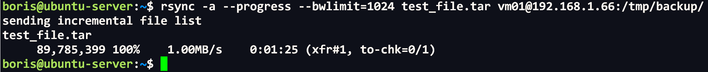
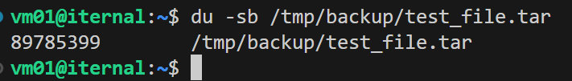

# Домашнее задание к занятию "`Резервное копирование`" - `Сидоров Борис`

---
---

### Задание 1
- Составьте команду rmamync, которая позволяет создавать зеркальную копию домашней директории пользователя в директорию `/tmp/backup`
- Необходимо исключить из синхронизации все директории, начинающиеся с точки (скрытые)
- Необходимо сделать так, чтобы rsync подсчитывал хэш-суммы для всех файлов, даже если их время модификации и размер идентичны в источнике и приемнике.
- На проверку направить скриншот с командой и результатом ее выполнения

---

### Решение 1
Начнем с простой, рекурсивной архивации данных, а именно домашней директории как требуется по заданию. Для этого использую аргумент **`-a`**. Выполню команду **`rsync -a . /tmp/backup/`** и проверю через утилиту **`du`** логический размер данных, по идее размер должен полностью совпадать.


Да, все верно. Удаляю резервную копию и пробую теперь сделать копию, исключив все скрытые директории. Для выполнения данной задачи я добавлю ключ **`--exclude='.*/'`**, т.е. исключу все директории, начинающиеся с точки, скрытые файлы останутся нетронутыми. Запускаю команду **`rsync -a --exclude='.*/' . /tmp/backup/`** и проверяю содержимое данных источника и назначения.


Да, все ок, скрытые директории не принимали участие при архивации утилиты **`rsync`**.
Теперь осуществим точную копию данных, так называемое зеркало, этого мы достигнем за счет сравнивания хеш-сумм источника и места назначения. Ключ для этого в **`rsync`** используется **`--checksum`**, **`-c`**. В итоге у меня получается следующая команда, которая будет копировать файлы с проверкой контрольных сумм, исключая скрытые директории:
**`rsync -av -c --exclude='.*/' . /tmp/backup/`**


В выводе я вижу файлы, которые были изменены, и даже если бы дата изменения была бы идентична и размер, то утилита благодаря аргументу **`--checksum`**, **`-c`** увидела бы, что контрольная сумма не совпадает и те файлы, которые уже ранее были архивированы, после ввода данной команды обновились.

И последний этап для достижения полной зеркальной копии домашней директории, за исключением скрытых директорий по требованию задания, это добавление аргумента **`--delete`**, на тот случай если какие-то файлы были удалены из целевой директории. Финальная команда получается такой:
**`rsync -a -c --delete --exclude='.*/' . /tmp/backup/`**

Если использовать абсолютные пути, то так:
**`rsync -a -c --delete --exclude='**/.*/' /home/boris/ /tmp/backup/`**

---
---

### Задание 2
- Написать скрипт и настроить задачу на регулярное резервное копирование домашней директории пользователя с помощью rsync и cron.
- Резервная копия должна быть полностью зеркальной
- Резервная копия должна создаваться раз в день, в системном логе должна появляться запись об успешном или неуспешном выполнении операции
- Резервная копия размещается локально, в директории `/tmp/backup`
- На проверку направить файл crontab и скриншот с результатом работы утилиты.

---

### Решение 2
На основе результата выполнения первой задачи, по составлению команды достижению цели зеркального копирования домашней директории, я буду использовать в скрипте команду **`rsync -a -c --delete /путь до целевой директории/ /путь до размещения бекапа`**. Итого получается такая команда:
**`rsync -a -c --delete /home/boris/ /tmp/backup/`**

Придерживаясь лучших практик по написанию скриптов, вынесу пути до директорий в отдельные переменные. Для записи в файл системных логов буду использовать утилиту **`logger`** с аргументом **`-t BACKUP`** для добавления тега, это позволит грепать системный лог по этому совпадению и проверять успешность или, наоборот, проблемы при создании бекапа. Так как скрипт будет простым, я не буду использовать функции, а просто опишу простым скриптом, а в условии **`if else`** буду ориентироваться на полученный код возврата, записанный в отдельную переменную **`EXIT_CODE`**, это и для логирования будет полезно. По итогу мой скрипт получился таким:

```bash
#!/bin/bash
SOURCE=/home/boris/
DESTINATION=/tmp/backup/

rsync -a -c --delete ${SOURCE} ${DESTINATION}
EXIT_CODVE=$?

if (( $EXIT_CODVE == 0));then
       logger -t BACKUP "Backup "$SOURCE" is success"
else    logger -t BACKUP "Backup "$SOURCE" is fault with exit code: "$EXIT_CODVE""
fi

```

Теперь редактирую файл **`cron`** через команду **`crontab -e`**, добавлю также запись в **`cron`** переменную **`PATH`** с путем **`/usr/bin`**, чтобы планировщик нашел бинарник к утилите **`rsync`** и **`logger`**. Для тестов пока выставлю выполнение скрипта каждую минуту:


Через **`tail -f`** и **`grep`** по тегу проверю, что происходит в логах:


Да, скрипт успешно отрабатывает. Проверю, что с логическим размером файлов домашней директории и бекапом:


Все ок. А теперь проверю, что будет записано в логах при неудачном выполнении скрипта, для этого поменяю путь до несуществующей домашней директории в скрипте:


Теперь вижу, что скрипт завершается с ошибкой, и код возврата, записанный в переменную, так же пригодился.
Далее, придерживаясь лучших практик администрирования, выставлю **`cron`** на 2 ночи каждого дня. Итоговый файл **`cron`** получился таким:
[cron file](files/hw-03/task-2/boris.txt)

---
---

### Задание 3*
- Настройте ограничение на используемую пропускную способность rsync до 1 Мбит/c
- Проверьте настройку, синхронизируя большой файл между двумя серверами
- На проверку направьте команду и результат ее выполнения в виде скриншота

---

### Решение 3
Для проведения тестов по синхронизации файла между двумя серверами буду использовать заархивированный **`deb`** пакет через стандартную утилиту **`tar`**. Сейчас получившийся файл весит **`86M`**.


Теперь попробую с помощью утилиты **`rsync`** синхронизировать данный файл между вторым сервером **`vm01`** по пути **`/tmp/backup/`**. Команда получается такой:
**`rsync -a --progress ./test_file.tar vm01@192.168.1.66:/tmp/backup/`**


Вижу, что процесс прошел успешно и файл был отправлен на указанный хост, но скорость передачи была максимальной, так как никаких ограничений не было указано. Теперь нужно убедиться, на удаленном появился ли данный файл на файловой системе, что внутри архива и сколько весит.


Да, все ок, файл был синхронизирован на **`100%`**.
Теперь попробуем по условию задания ограничить скорость передачи данных до **`1Мбит/c`**. Для этого в утилите **`rsync`** можно использовать аргумент **`--bwlimit=СКОРОСТЬ`**. Удаляю на удаленном сервере тестовый архив и пробую передать тот же файл, но уже с ограничением по скорости, чтобы не забивать канал в полную. Итоговая команда получается такой:
**`rsync -a --progress --bwlimit=1024 test_file.tar vm01@192.168.1.66:/tmp/backup/`**


Теперь файл передавался на удаленный сервер уже с ограничением по скорости, и времени на передачу соответственно заняло больше.
Проверю логический размер на удаленном сервере, совпадает ли он с тем, что указан в подробном выводе при передаче файла, а именно **`89785399 байт`**.


Все верно, полная синхронизация была достигнута при передаче файла с ограничением скорости.