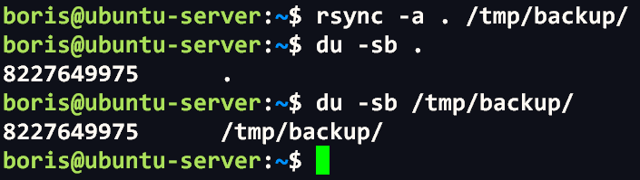
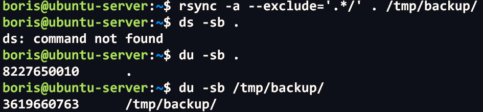
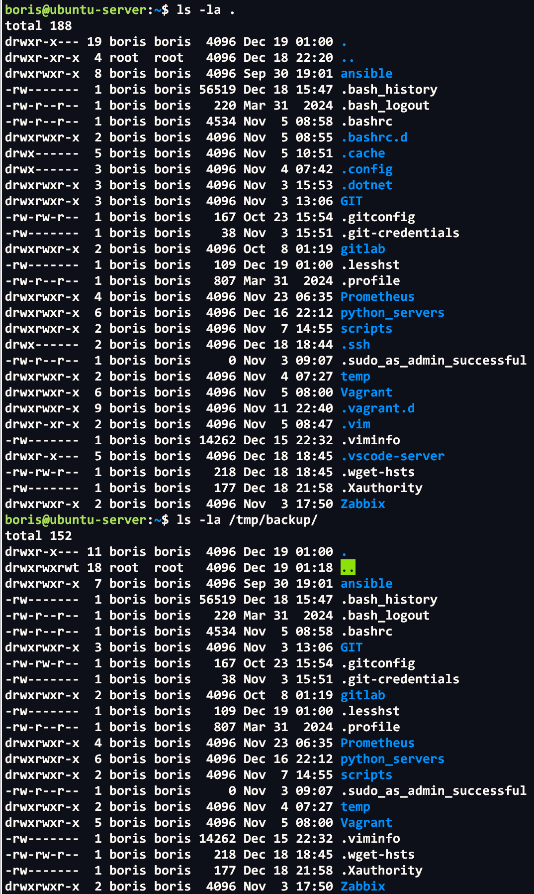
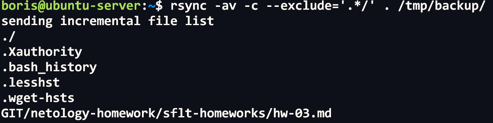

# Домашнее задание к занятию "`Резервное копирование`" - `Сидоров Борис`

---
---

### Задание 1
- Составьте команду rmamync, которая позволяет создавать зеркальную копию домашней директории пользователя в директорию `/tmp/backup`
- Необходимо исключить из синхронизации все директории, начинающиеся с точки (скрытые)
- Необходимо сделать так, чтобы rsync подсчитывал хэш-суммы для всех файлов, даже если их время модификации и размер идентичны в источнике и приемнике.
- На проверку направить скриншот с командой и результатом ее выполнения

---

### Решение 1
Начнем с простой, рекурсивной архивации данных, а именно домашней директории как требуется по заданию. Для этого использую аргумент **`-a`**. Выполню команду **`rsync -a . /tmp/backup/`** и проверю через утилиту **`du`** логический размер данных, по идее размер должен полностью совпадать.

Да, все верно. Удаляю резервную копию и пробую теперь сделать копию, исключив все скрытые директории. Для выполнения данной задачи я добавлю ключ **`--exclude='.*/'`**, т.е. исключу все директории, начинающиеся с точки, скрытые файлы останутся нетронутыми. Запускаю команду **`rsync -a --exclude='.*/' . /tmp/backup/`** и проверяю содержимое данных источника и назначения.

Да, все ок, скрытые директории не принимали участие при архивации утилиты **`rsync`**.
Теперь осуществим точную копию данных, так называемое зеркало, этого мы достигнем за счет сравнивания хеш-сумм источника и места назначения. Ключ для этого в **`rsync`** используется **`--checksum`**, **`-c`**. В итоге у меня получается следующая команда, которая будет копировать файлы с проверкой контрольных сумм, исключая скрытые директории:
**`rsync -av -c --exclude='.*/' . /tmp/backup/`**

В выводе я вижу файлы, которые были изменены, и даже если бы дата изменения была бы идентична и размер, то утилита благодаря аргументу **`--checksum`**, **`-c`** увидела бы, что контрольная сумма не совпадает и те файлы, которые уже ранее были архивированы, после ввода данной команды обновились.git