# Домашнее задание к занятию "`Резервное копирование`" - `Сидоров Борис`

---
---

### Задание 1
- Составьте команду rmamync, которая позволяет создавать зеркальную копию домашней директории пользователя в директорию `/tmp/backup`
- Необходимо исключить из синхронизации все директории, начинающиеся с точки (скрытые)
- Необходимо сделать так, чтобы rsync подсчитывал хэш-суммы для всех файлов, даже если их время модификации и размер идентичны в источнике и приемнике.
- На проверку направить скриншот с командой и результатом ее выполнения

---

### Решение 1
Начнем с простой, рекурсивной архивации данных, а именно домашней директории как требуется по заданию. Для этого использую аргумент **`-a`**. Выполню команду **`rsync -a . /tmp/backup/`** и проверю через утилиту **`du`** логический размер данных, по идее размер должен полностью совпадать.
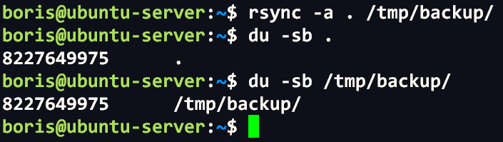

Да, все верно. Удаляю резервную копию и пробую теперь сделать копию, исключив все скрытые директории. Для выполнения данной задачи я добавлю ключ **`--exclude='.*/'`**, т.е. исключу все директории, начинающиеся с точки, скрытые файлы останутся нетронутыми. Запускаю команду **`rsync -a --exclude='.*/' . /tmp/backup/`** и проверяю содержимое данных источника и назначения.
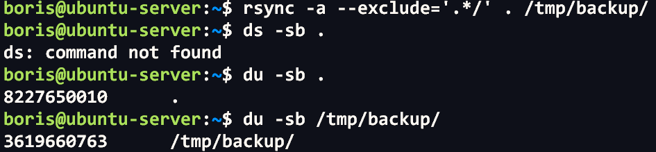

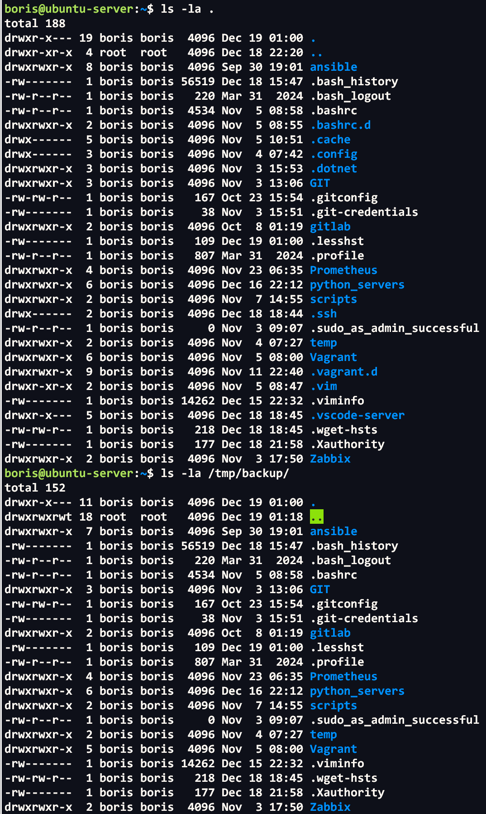

Да, все ок, скрытые директории не принимали участие при архивации утилиты **`rsync`**.
Теперь осуществим точную копию данных, так называемое зеркало, этого мы достигнем за счет сравнивания хеш-сумм источника и места назначения. Ключ для этого в **`rsync`** используется **`--checksum`**, **`-c`**. В итоге у меня получается следующая команда, которая будет копировать файлы с проверкой контрольных сумм, исключая скрытые директории:
**`rsync -av -c --exclude='.*/' . /tmp/backup/`**
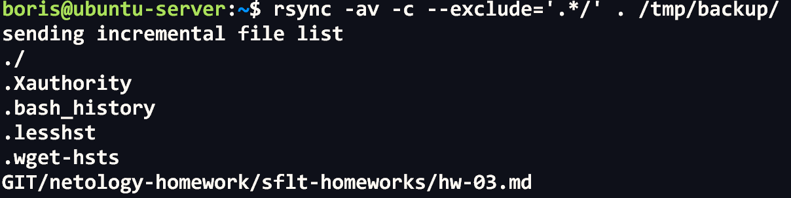

В выводе я вижу файлы, которые были изменены, и даже если бы дата изменения была бы идентична и размер, то утилита благодаря аргументу **`--checksum`**, **`-c`** увидела бы, что контрольная сумма не совпадает и те файлы, которые уже ранее были архивированы, после ввода данной команды обновились.

И последний этап для достижения полной зеркальной копии домашней директории, за исключением скрытых директорий по требованию задания, это добавление аргумента **`--delete`**, на тот случай если какие-то файлы были удалены из целевой директории. Финальная команда получается такой:
**`rsync -a -c --delete --exclude='.*/' . /tmp/backup/`**

Если использовать абсолютные пути, то так:
**`rsync -a -c --delete --exclude='**/.*/' /home/boris/ /tmp/backup/`**

---
---

### Задание 2
- Написать скрипт и настроить задачу на регулярное резервное копирование домашней директории пользователя с помощью rsync и cron.
- Резервная копия должна быть полностью зеркальной
- Резервная копия должна создаваться раз в день, в системном логе должна появляться запись об успешном или неуспешном выполнении операции
- Резервная копия размещается локально, в директории `/tmp/backup`
- На проверку направить файл crontab и скриншот с результатом работы утилиты.

---

### Решение 2
На основе результата выполнения первой задачи, по составлению команды достижению цели зеркального копирования домашней директории, я буду использовать в скрипте команду **`rsync -a -c --delete /путь до целевой директории/ /путь до размещения бекапа`**. Итого получается такая команда:
**`rsync -a -c --delete /home/boris/ /tmp/backup/`**

Придерживаясь лучших практик по написанию скриптов, вынесу пути до директорий в отдельные переменные. Для записи в файл системных логов буду использовать утилиту **`logger`** с аргументом **`-t BACKUP`** для добавления тега, это позволит грепать системный лог по этому совпадению и проверять успешность или, наоборот, проблемы при создании бекапа. Так как скрипт будет простым, я не буду использовать функции, а просто опишу простым скриптом, а в условии **`if else`** буду ориентироваться на полученный код возврата, записанный в отдельную переменную **`EXIT_CODE`**, это и для логирования будет полезно. По итогу мой скрипт получился таким:

```bash
#!/bin/bash
SOURCE=/home/boris/
DESTINATION=/tmp/backup/

rsync -a -c --delete ${SOURCE} ${DESTINATION}
EXIT_CODVE=$?

if (( $EXIT_CODVE == 0));then
       logger -t BACKUP "Backup "$SOURCE" is success"
else    logger -t BACKUP "Backup "$SOURCE" is fault with exit code: "$EXIT_CODVE""
fi

```

Теперь редактирую файл **`cron`** через команду **`crontab -e`**, добавлю также запись в **`cron`** переменную **`PATH`** с путем **`/usr/bin`**, чтобы планировщик нашел бинарник к утилите **`rsync`** и **`logger`**. Для тестов пока выставлю выполнение скрипта каждую минуту:
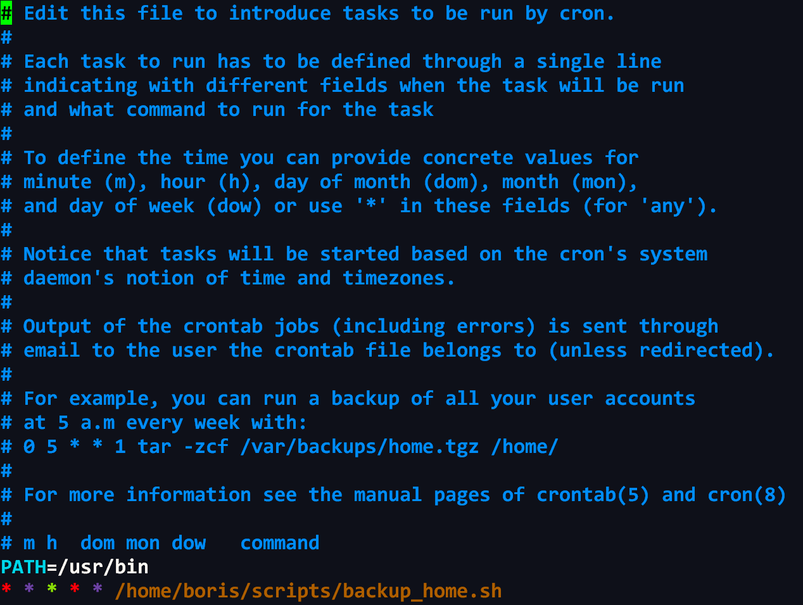

Через **`tail -f`** и **`grep`** по тегу проверю, что происходит в логах:
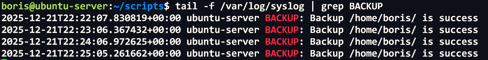

Да, скрипт успешно отрабатывает. Проверю, что с логическим размером файлов домашней директории и бекапом:
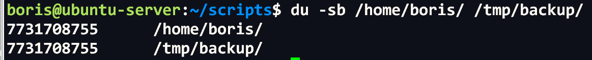

Все ок. А теперь проверю, что будет записано в логах при неудачном выполнении скрипта, для этого поменяю путь до несуществующей домашней директории в скрипте:
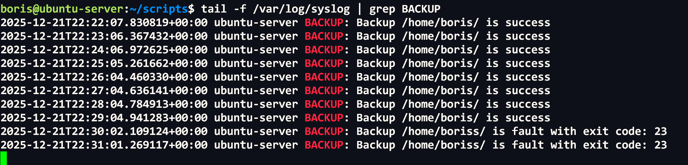

Теперь вижу, что скрипт завершается с ошибкой, и код возврата, записанный в переменную, так же пригодился.
Далее, придерживаясь лучших практик администрирования, выставлю **`cron`** на 2 ночи каждого дня. Итоговый файл **`cron`** получился таким:
[cron file](files/hw-03/task-2/boris.txt)

---
---

### Задание 3*
- Настройте ограничение на используемую пропускную способность rsync до 1 Мбит/c
- Проверьте настройку, синхронизируя большой файл между двумя серверами
- На проверку направьте команду и результат ее выполнения в виде скриншота

---

### Решение 3
Для проведения тестов по синхронизации файла между двумя серверами буду использовать заархивированный **`deb`** пакет через стандартную утилиту **`tar`**. Сейчас получившийся файл весит **`86M`**.
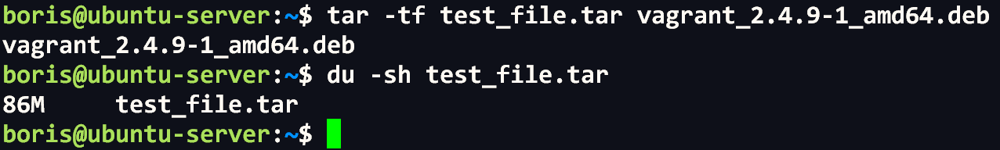

Теперь попробую с помощью утилиты **`rsync`** синхронизировать данный файл между вторым сервером **`vm01`** по пути **`/tmp/backup/`**. Команда получается такой:
**`rsync -a --progress ./test_file.tar vm01@192.168.1.66:/tmp/backup/`**
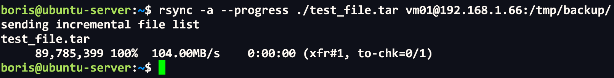

Вижу, что процесс прошел успешно и файл был отправлен на указанный хост, но скорость передачи была максимальной, так как никаких ограничений не было указано. Теперь нужно убедиться, на удаленном сервере появился ли данный файл на файловой системе, что внутри архива и сколько весит.
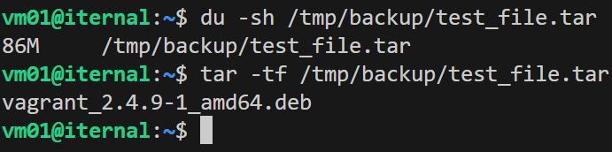

Да, все ок, файл был синхронизирован на **`100%`**.
Теперь попробуем по условию задания ограничить скорость передачи данных до **`1Мбит/c`**. Для этого в утилите **`rsync`** можно использовать аргумент **`--bwlimit=СКОРОСТЬ`**. Удаляю на удаленном сервере тестовый архив и пробую передать тот же файл, но уже с ограничением по скорости, чтобы не забивать канал в полку. Итоговая команда получается такой:
**`rsync -a --progress --bwlimit=1024 test_file.tar vm01@192.168.1.66:/tmp/backup/`**
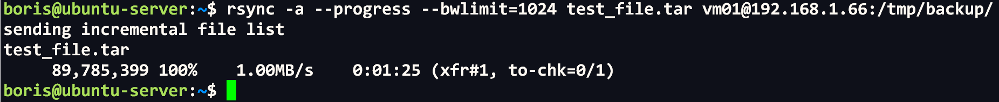

Теперь файл передавался на удаленный сервер уже с ограничением по скорости, и времени на передачу соответственно заняло больше.
Проверю логический размер на удаленном сервере, совпадает ли он с тем, что указан в подробном выводе при передаче файла, а именно **`89785399 байт`**.
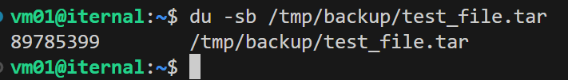

Все верно, полная синхронизация была достигнута при передаче файла с ограничением скорости.

---
---

### Задание 4*
- Напишите скрипт, который будет производить инкрементное резервное копирование домашней директории пользователя с помощью rsync на другой сервер
- Скрипт должен удалять старые резервные копии (сохранять только последние 5 штук)
- Напишите скрипт управления резервными копиями, в нем можно выбрать резервную копию и данные восстановятся к состоянию на момент создания данной резервной копии.
- На проверку направьте скрипт и скриншоты, демонстрирующие его работу в различных сценариях.

---

### Решение 4
Начнем с создания скрипта по **`инкрементному копированию`**. 
Идея такая, сперва создаем **`полный бекап`** данных, это будет точка отсчета и там будут все данные на момент создания бэкапа. Далее уже будем создавать **`инкрементный бэкап`** и хранить буду в отдельной директории с логичным названием. Создаваться **`инкрементный бэкап`** будет через поиск пути директории с самым свежим, т.е. последним созданным инкрементным бекапом. Для удаления самого старого бекапа буду использовать обычную утилиту **`ls -d path_to_dir | head -1`**, благодаря истории создания директории с бэкапами я буду удалять именно самый старый бэкап. Для запуска процесса удаления старого бэкапа, буду считать количество директорий с инкрементными бэкапами через **`ls -ld путь до директории с инкрементными директория | wc -l`**, тем самым я получу количество директорий или если проще выражаясь количество инкрементальных бэкапов. Далее через условие **`if else`** я просто буду запускать процесс удаления старого инкрементного бека в случае если счетчик будет равен **`5`**, то значит пора удалять старый бекап. Также в условии будет присутствовать и проверка директории с полным бекапом, если вдруг она пуста, то будет запущен процесс создания полного бекапа, так как без **`полного бэкапа`**, в **`инкрементных бэкапах`** есть риск потери данных.
Все команды будут описаны в виде **`функций`**, для экономии строчек кода и читаемости. 
Важным нюансом и преимуществом ключа **`--link-dest`** это создание **`жестких ссылок`**, т.е у меня будет общий **`inode`** у файла если он не был изменен, а это значит, что каждый **`инкрементный бэкап`** становиться самостоятельным и независимым от других **`инкрементальных бэкапов`** и можно будет удалять старые и хранить до **`5`** штук.
И так мой итоговый скрипт выглядит так:
[incr_sh](files/hw-03/task-4/incremental_backup.sh)

Перед демонстрацией скрипта, зачищу все директории по пути **`/tmp/backup/*`** на удаленном сервере, где будут хранится все **`резервные копии`**.
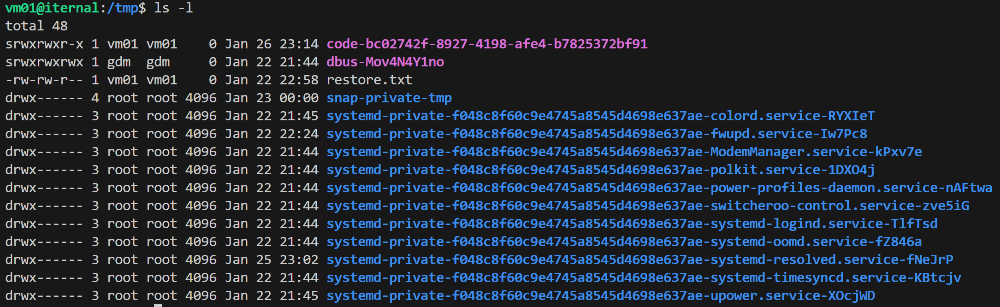

Далее, с целевого хоста я запущу **`скрипт`**. **`Скрипт`** настроен на копировании директории **`/home/boris/GIT`**.


Проверю, что появилось в на **`удаленном сервере`**.
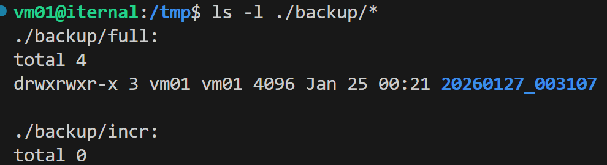

Вижу, что появились директории под **`бекапы`** **`full`**, **`incr`** и создался **`полный бекап`**. Для именования директории используется команда **`date +%Y%m%d_%H%M%S`**, так будет понятно когда и во сколько был создан **`бэкап`**.

Теперь наполню директорию **`инкрементными бэкапами`**, запущу **`скрипт`** **`5`** раз.
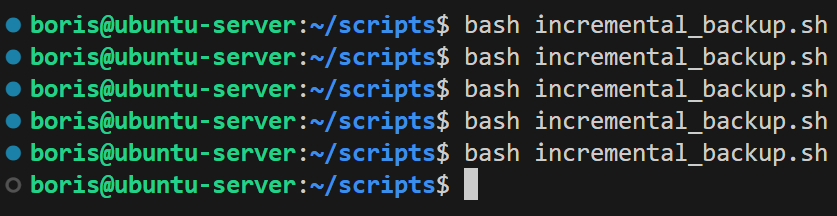

Проверю, что появилось на **`удаленном сервере`**.
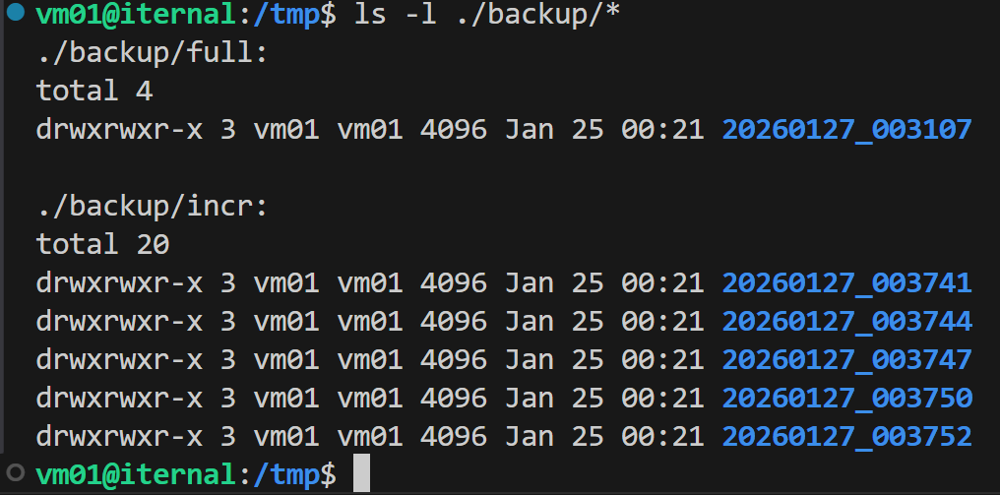

Все работает, создались **`5`** **`инкрементальных бэкапов`**.

Теперь попробую создать ещё один, по логике **`бэкап`** **`20260127_003741`** должен быть удален так как он получается самый старый, а за место него появится новый. Запускаю **`скрипт`** ещё раз.
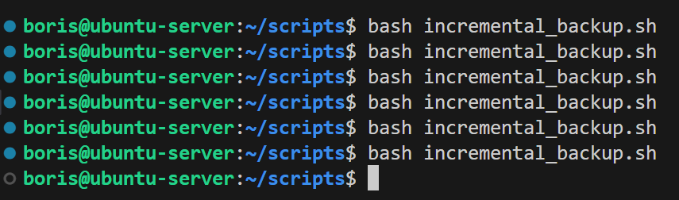

Проверяем.
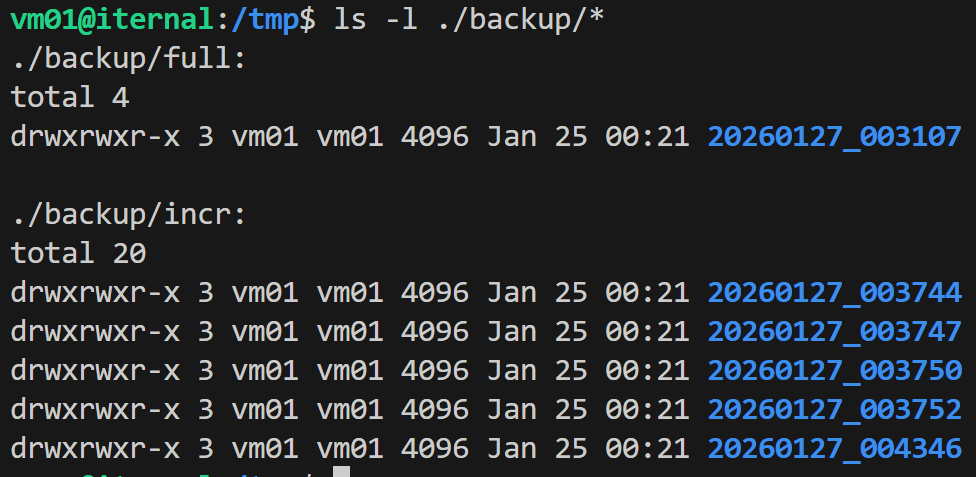

Работает, директория **`20260127_003741`** удалена и появилась новая со свежим **`бэкапом`**.
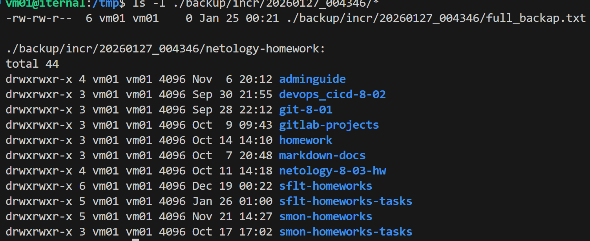


Теперь касательно **`скрипта по восстановлению данных`**. Процесс восстановления по сути это тот же самый **`rsync`** просто меняется источник и назначение местами, единственное я оставлю только ключ **`-a`** для восстановления полностью данных как есть в **`бэкапе`**. В **`скрипте`** переменные не буду переименовывать, просто изменю последовательность при их применении в описании **`функции`**. 
Задача при восстановлении данных, в **`функцию`** где будет запущена программа **`rsync`**, передать путь до необходимого пользователю директории с **`бэкапом`**. 
Для реализации списка **`бэкапов`** я создам **`ассоциативный массив`** данных, который наполю через цикл **`for`** все существующие пути к директориям с **`бэкапами`**, через команду **`ls -d`**, индекс сразу выставлю **`1`** через объявленную ранее переменную. 
Теперь чтобы вывести в консоль пользователю всю информацию о существующих **`бэкапах`** я создам **`функцию`**, в которой последовательно будет через **`echo`** выводиться данные: цифра = путь к **`бэкапу`**.
После выбора пользователя цифры варианта с **`бэкапом`** через **`read`** этот выбор будет записан в переменную и впоследствии будет передан как **`аргумент`** в **`функцию`** где запуститься команда **`rsync`**, а цифра будет являться **`индексом`** в **`массиве данных`** который сформировывается в самом начале **`скрипта`**.
Также я добавлю **`функцию`** в котором будет описан вечный цикл для подтверждения выбора варианта пользователя. Сперва будет выводиться выбранный вариант пользователя и если он введет **`yes`**, тогда будет вызвана **`функция восстановления данных`**, после восстановления опишу возврат кода **`0`**, если пользователь укажет **`No`** код **`1`**. Эту **`функцию`** я буду использовать в условии **`if else`**, если **`функция`** завершается с кодом **`0`**, то **`скрипт`** прерывается через **`break`** так как пользователь подтвердил выбор и была вызвана **`функция с восстановления данных`**, если же код **`1`**, то это значит, что пользователь не согласен и **`функция`** с вечным циклом продолжает свою работу пока пользователь не укажет **`yes`** или отменит **`скрипт`**.
По итогу **`скрипт`** получился таким:
[restore_data srcript](files/hw-03/task-4/restore_data.sh)

Для демонстрации работы **`скрипта`** в директории которая будет использоваться как **`резервная копия`** создам текстовый файл с цифрой, этой будет маркер при восстановлении из того или иного **`бекапа`**. Перед каждым новым **`бэкапом`** я затру предыдущий файл, к примеру **`1.txt`** и создам новый **`2.txt`**. Тем  самым у меня получится **`6 бекапов`**, в  которых хранится свой файл **`txt`**, к примеру первый **`фулл бекап`** будет храниться файл с названием **`1.txt.`**, а в последнем **`инкрементном`** будет **`6.txt`**. 
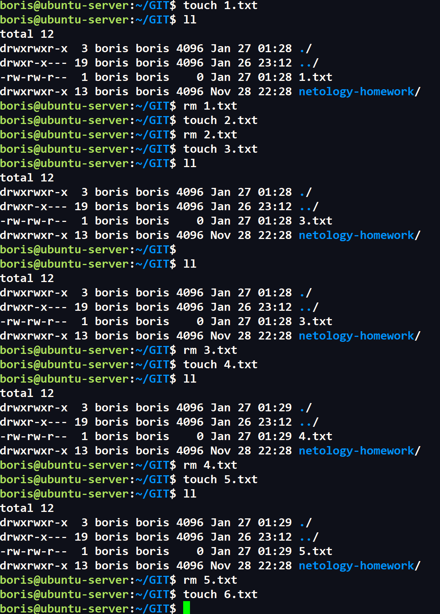
 
Удаляю полностью директорию **`~/GIT`** и запускаю **`скрипт восстановления данных`**. Сперва выберу **`полный бекап`**, там должен быть файл **`1.txt`**.
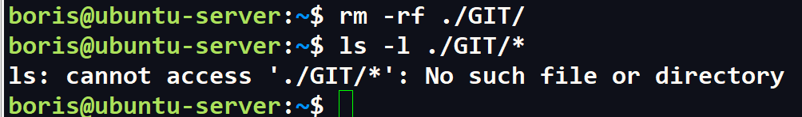

Удалил директорию, запускаю **`скрипт восстановления`**.
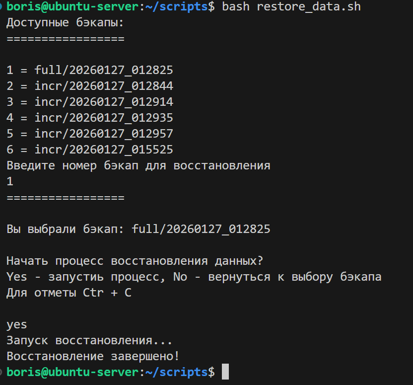


Работает, директория полностью восстановлена и файл **`1.txt`** на месте.
Теперь ещё раз удалю директорию **`GIT`** и попробую восстановиться уже из последней директории.
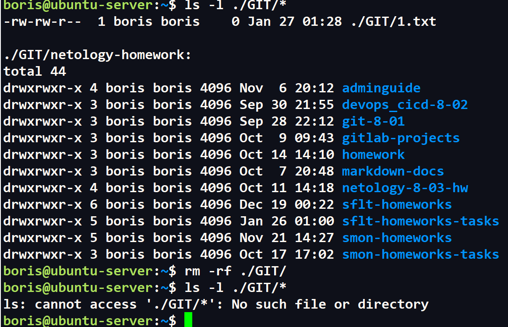
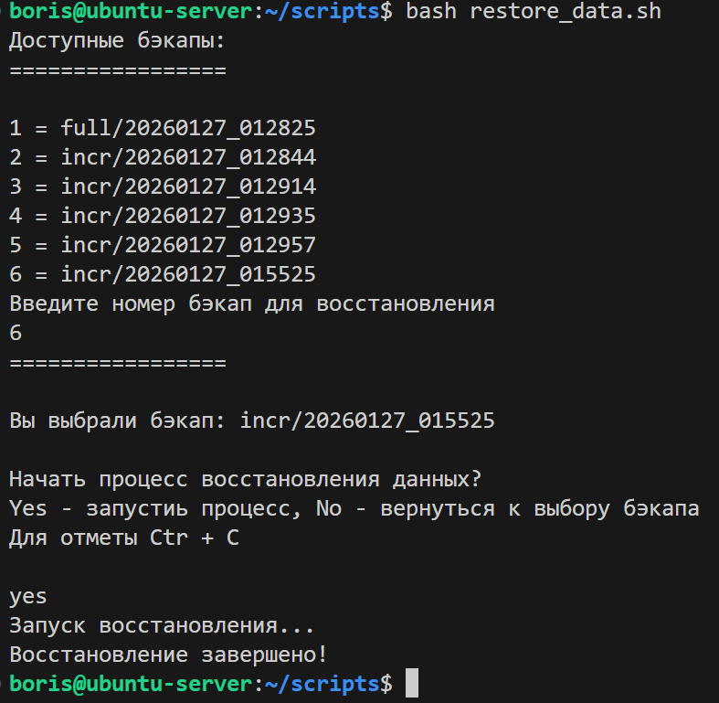

Восстановление прошло, проверяем результат.
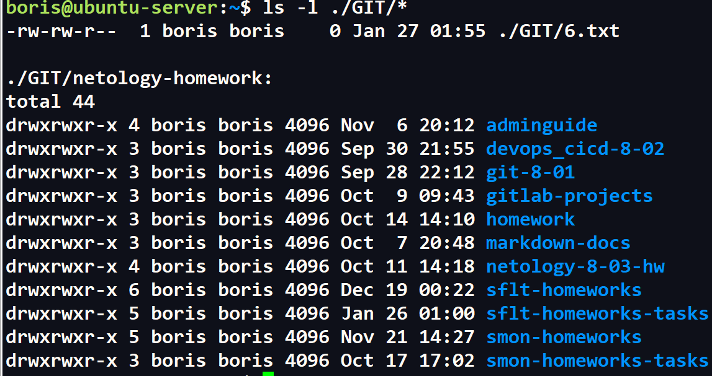

Работает! **`Скрипт`** восстановил последний **`5-й инкрементный бэкап`** в котором хранился файл **`6.txt`**!
На последок демонстрация случая если пользователь не уверен в выборе или ввел некорректное слов что в шаблоне **`case`** не было учтено.
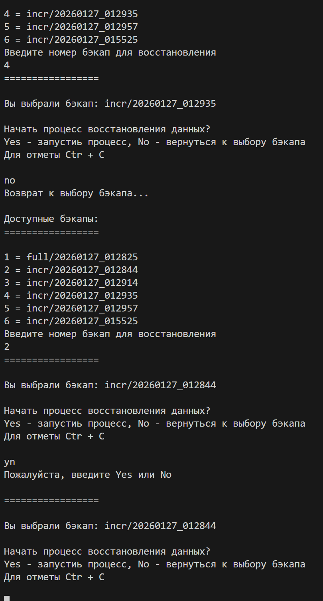