# Домашнее задание к занятию "`Отказоустойчивость в облаке`" - `Сидоров Борис`

---
---

## Задание 1 

Возьмите за основу [решение к заданию 1 из занятия «Подъём инфраструктуры в Яндекс Облаке»](https://github.com/netology-code/sdvps-homeworks/blob/main/7-03.md#задание-1).

1. Теперь вместо одной виртуальной машины сделайте terraform playbook, который:

- создаст 2 идентичные виртуальные машины. Используйте аргумент [count](https://www.terraform.io/docs/language/meta-arguments/count.html) для создания таких ресурсов;
- создаст [таргет-группу](https://registry.terraform.io/providers/yandex-cloud/yandex/latest/docs/resources/lb_target_group). Поместите в неё созданные на шаге 1 виртуальные машины;
- создаст [сетевой балансировщик нагрузки](https://registry.terraform.io/providers/yandex-cloud/yandex/latest/docs/resources/lb_network_load_balancer), который слушает на порту 80, отправляет трафик на порт 80 виртуальных машин и http healthcheck на порт 80 виртуальных машин.

Рекомендуем изучить [документацию сетевого балансировщика нагрузки](https://cloud.yandex.ru/docs/network-load-balancer/quickstart) для того, чтобы было понятно, что вы сделали.

2. Установите на созданные виртуальные машины пакет Nginx любым удобным способом и запустите Nginx веб-сервер на порту 80.

3. Перейдите в веб-консоль Yandex Cloud и убедитесь, что: 

- созданный балансировщик находится в статусе Active,
- обе виртуальные машины в целевой группе находятся в состоянии healthy.

4. Сделайте запрос на 80 порт на внешний IP-адрес балансировщика и убедитесь, что вы получаете ответ в виде дефолтной страницы Nginx.

*В качестве результата пришлите:*

*1. Terraform Playbook.*

*2. Скриншот статуса балансировщика и целевой группы.*

*3. Скриншот страницы, которая открылась при запросе IP-адреса балансировщика.*

---

### Решение 1
Перед выполнением развертывания инфраструктуры в облаке, согласно документации **`yandex cloud`**, все чувствительные данные записал в переменные окружения **`YC_*`**. 

В рамках текущего задания, проект **`terraform`** состоит из несколько файлов **`.tf`**, не стал все описывать в одном файле. Таким образом у меня вышло несколько файлов, а именно:

- **[network.tf](terraform-project/tf-hw04-task1/network.tf)** (в нем описано создание сети, подсети, таргет группы для балансировщика, сам балансировщик)

- **[providers.tf](terraform-project/tf-hw04-task1/providers.tf)** (описание требуемого провайдера для возможности взаимодействия с облаком **`yandex cloud`**)

- **[variabels.tf](terraform-project/tf-hw04-task1/variabels.tf)** (файл в котором созданы переменные)

- **`terraform.tfvars`** (файл в котором содержится чувствительные данные для созданных переменных. Этот файл отсутствует в репозитории так как подпадает под описание исключений файла **`.gitignore`**)

- **[vm.tf](terraform-project/tf-hw04-task1/vm.tf)** (файл в котором описано создание идентичных **`VM`** с использованием атрибута **`count`**, для экономии строчек кода и возможности масштабируемости)

- **[local.tf](terraform-project/tf-hw04-task1/local.tf)** файл в котором описан процесс создания **`инвентори`** файла для **`ansible`**, через заполнения **`хердок`**.

Так как автономизацию настроек **`VM`** я буду выполнять через **`ansible`**, в проекте присутствуют файлы относящиеся для **`ansible`**:
- **[playbook.yml](terraform-project/tf-hw04-task1/playbook.yml)** (для простоты понимания это и есть основной плейбук с одноименным названием)

- **[roles/](terraform-project/tf-hw04-task1/roles)** (директория со структурой роли для **`ansible`**, в ней описана задача по установке пакета **`nginx`** и замены шаблона **`html.index`**)

Файл **`inventory`** для **`ansible`** будет формироваться через встроенный ресурс **`terraform`** **`local_file`**.

**Демонстрация работы:**
Запускаю **`terraform apply`** и смотрю что получилось в облаке.
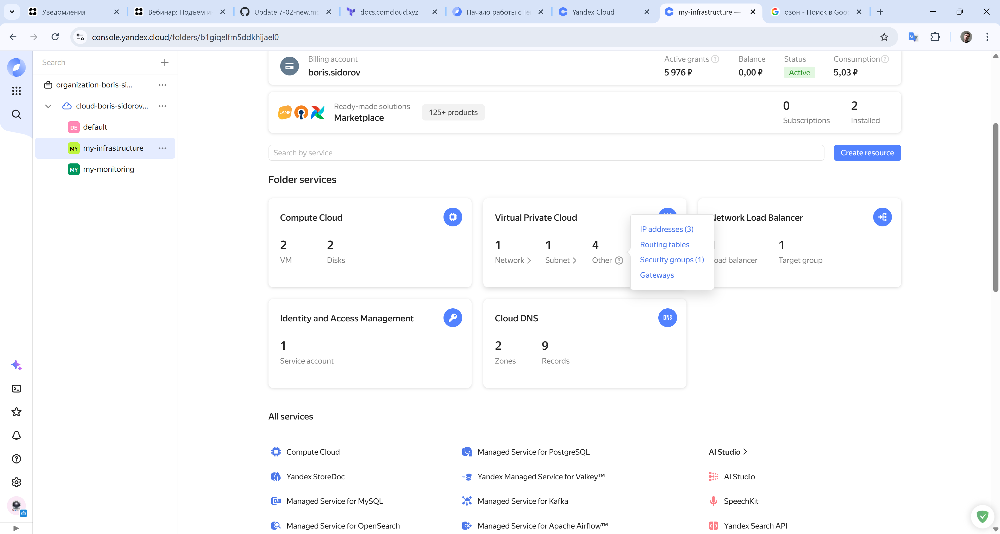

Вижу, что все основные сущности такие как **`VM`**, **`Network`**, **`Subnet`**, **`Load balancer`**, **`Target group`** созданы и дополнительные элементы которые создаются по умолчанию.
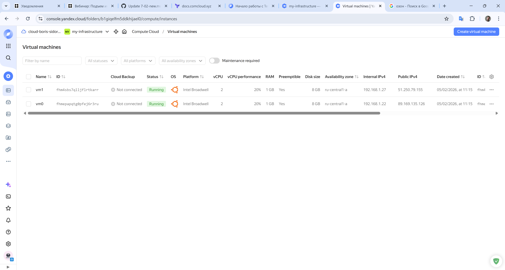

.png)

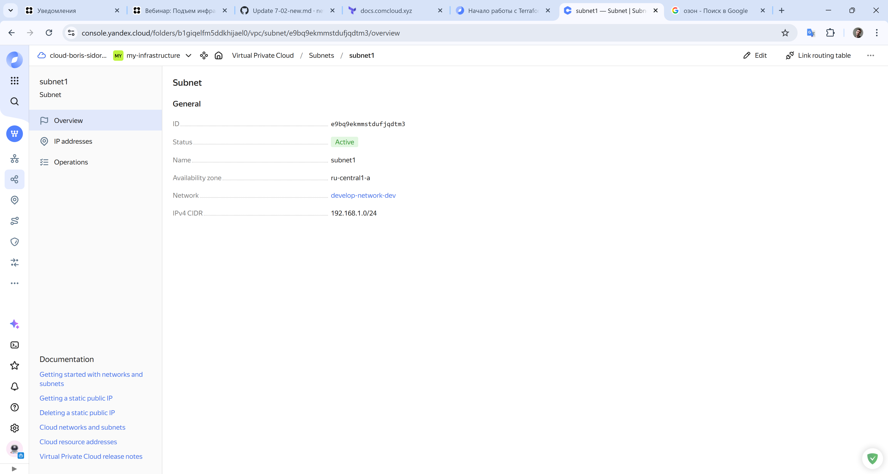

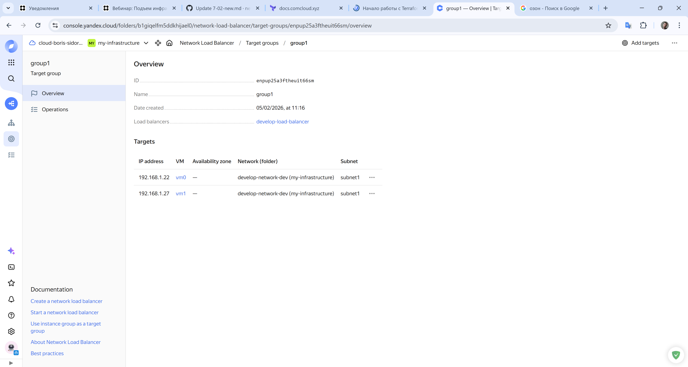

Видно, что пока состояние **`ВМ`** в таргет группе в статусе “нездоровый” так как ещё не запустил **`ansible`** для конфигурации **`ВМ`**.
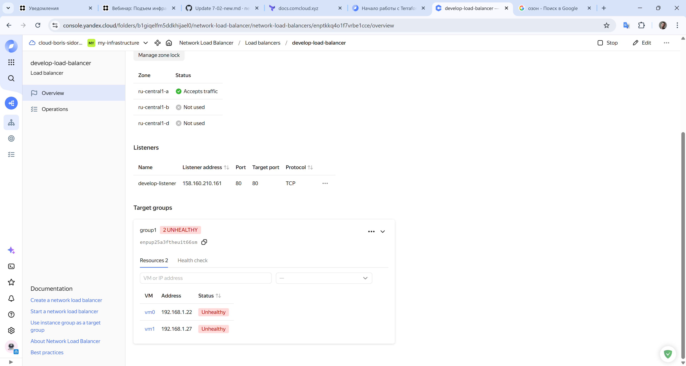

Запускаю **`ansible`** с готовым файлом **`inventory`**, который был создан после выполнения провайдера **`local_file`**. В **`vars`**, добавил для **`ssh`** соединения автоматически добавлять отпечаток, для того чтобы скрипт не прерывался.
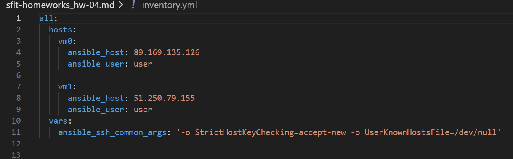

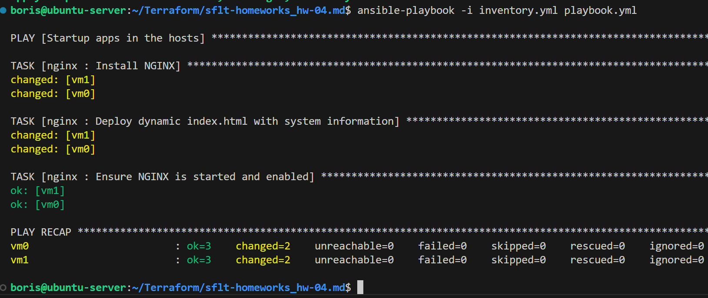

**`nginx`** на **`vm`** установлен и сконфигурирован на прослушивание порта **`80`**. Теперь проверим состояние **`ВМ`** в таргет группе.
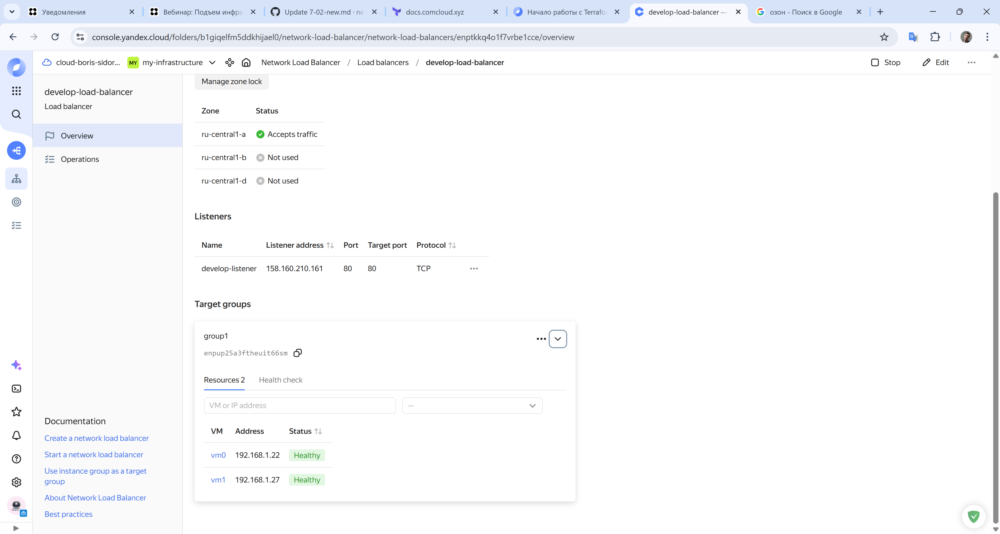

Теперь попробую обратиться по **`ip`** адресу балансировщика и проверить результат.
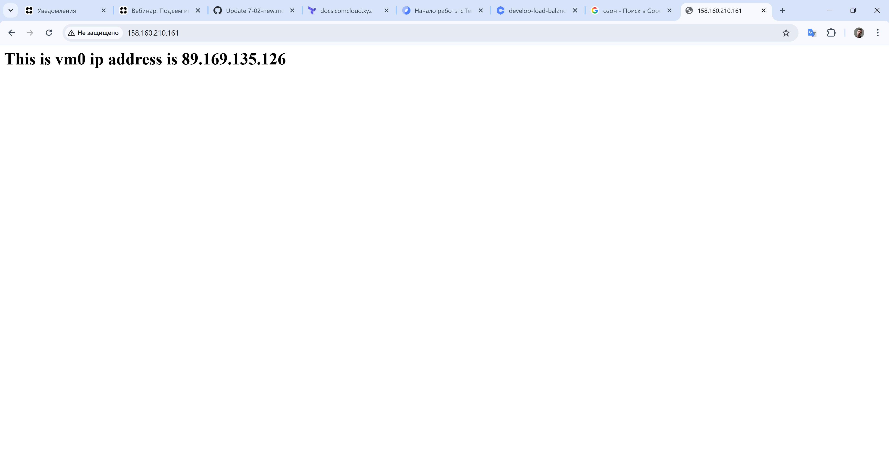

Ответил **`ВМ vm0`** с **`ip 89.169.135.126`**. Попробую через консоль используя **`curl`** несколько раз обратиться к **`ip`** балансировщика:
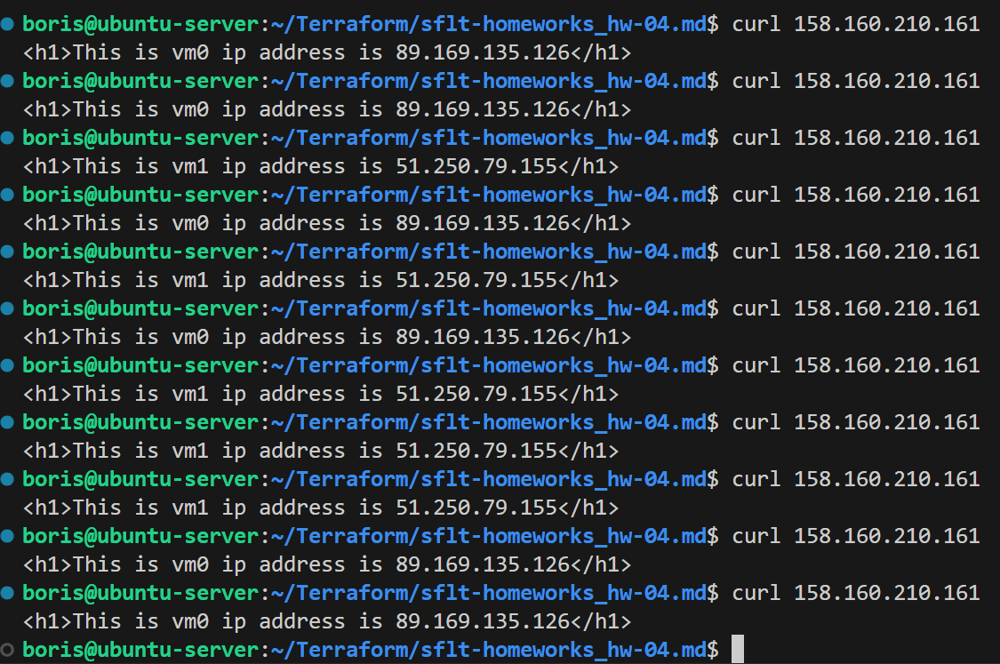

Видно, что балансировка работает и отвечают разные хосты в таргет группе. Теперь попробуй отключить **`vm0`** и проверить, сработает ли балансировка.
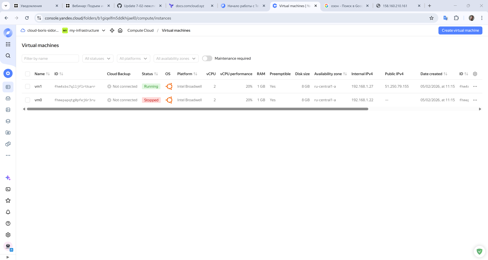

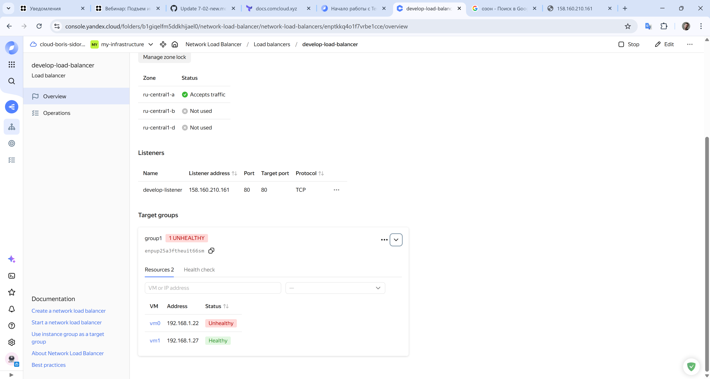

Видно, что один из хостов в статусе “нездоровый”. Пробую сделать **`curl`**.
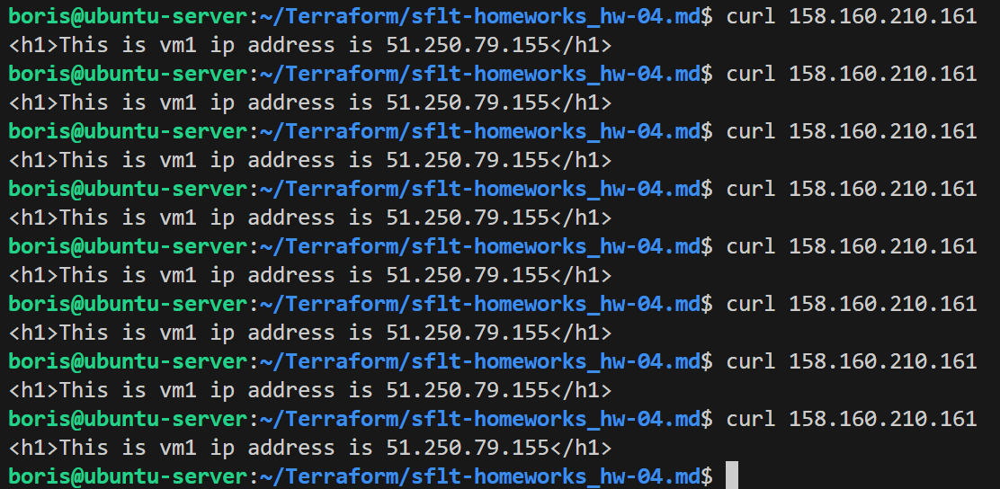

Все работает, теперь балансировщик перенаправляет запрос на хост **`vm1`**, так он в группе в статусе “здоровый” и готов к приему трафика.

После работы удаляю свою тестовую инфраструктуру для экономии средств.

После создания балансировщика и ознакомлении с документацией делаю вывод, что запрос который направлен на белый **`ip`** адрес балансировщика проходит через обработчик. Обработчик работает на всех доступных зонах **`yandex облака`** и он может быть не один и каждый обработчик будет принимать трафик на конкретном порту который мы укажем и перенаправлять на порт таргет группы, опять же который мы укажем. Помимо обработчика, который работает с сетевым трафиком в балансировщике есть механизм проверки состояния **`ВМ`** в группах **“healthcheck”**. Данные проверки можно организовать используя разные подходы, можно выбрать тип проверки **`tcp`**, тогда **“healthcheck”** будет работать на 4-м уровне **`osi`**, или **`http + путь`**, тогда проверка будет осуществлять на 7 уровне **`osi`**. Если вдруг какая либо **`ВМ`** перестанет отвечать на запросы **“healthcheck”**, то она будет переведена в статус “неживой” и последующий трафик уже не будет направляться на эту **`ВМ`**. Алгоритм распределения нагрузки в **`NLB`** использует **`Hash`**.

---
---

## Задание 2*

1. Теперь вместо создания виртуальных машин создайте [группу виртуальных машин с балансировщиком нагрузки](https://cloud.yandex.ru/docs/compute/operations/instance-groups/create-with-balancer).

2. Nginx нужно будет поставить тоже автоматизированно. Для этого вам нужно будет подложить файл установки Nginx в user-data-ключ [метадаты](https://cloud.yandex.ru/docs/compute/concepts/vm-metadata) виртуальной машины.

- [Пример файла установки Nginx](https://github.com/nar3k/yc-public-tasks/blob/master/terraform/metadata.yaml).
- [Как подставлять файл в метадату виртуальной машины.](https://github.com/nar3k/yc-public-tasks/blob/a6c50a5e1d82f27e6d7f3897972adb872299f14a/terraform/main.tf#L38)

3. Перейдите в веб-консоль Yandex Cloud и убедитесь, что: 

- созданный балансировщик находится в статусе Active,
- обе виртуальные машины в целевой группе находятся в состоянии healthy.

4. Сделайте запрос на 80 порт на внешний IP-адрес балансировщика и убедитесь, что вы получаете ответ в виде дефолтной страницы Nginx.

*В качестве результата пришлите*

*1. Terraform Playbook.*

*2. Скриншот статуса балансировщика и целевой группы.*

*3. Скриншот страницы, которая открылась при запросе IP-адреса балансировщика.*

---

### Решение 2

